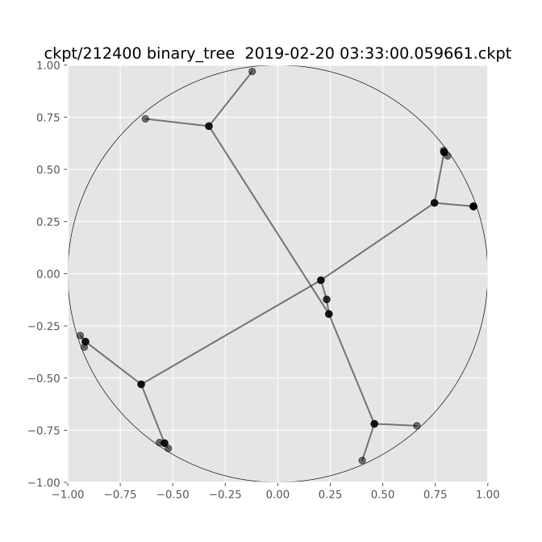

Lorentz Embeddings
==================


A pytorch implementation of [Learning Continuous Hierarchies in the Lorentz Model of Hyperbolic Geometry](https://arxiv.org/pdf/1806.03417.pdf?noredirect=1).

> We are concerned with the discovery of hierarchical relationships from large-scale unstructured similarity scores. For this purpose, we study different models of hyperbolic space and find that learning embeddings in the Lorentz model is substantially more efficient than in the Poincaré-ball model. We show that the proposed approach allows us to learn high-quality embeddings of large taxonomies which yield improvements over Poincaré embeddings, especially in low dimensions. Lastly, we apply our model to discover hierarchies in two real-world datasets: we show that an embedding in hyperbolic space can reveal important aspects of a company’s organizational structure as well as reveal historical relationships between language families.

An example of a binary tree being embedded in the Lorentz space and then visualized using Poincaré space.


**NOTE** :  [@lambdaofgod](https://github.com/lambdaofgod) has generously ported this work to use sparse matrices and a bunch of other nice things! Go check out the PR at https://github.com/theSage21/lorentz-embeddings/pull/15 . We haven't merged that work since it does not have updated examples. If you have the time please go ahead and submit a PR to either their repo or this one.

Usage
-----

Binary tree embedding and visualization.

```bash
# See this for more options
python lorentz.py --help


python lorentz.py bin_mat  # run binary tree


# plot the checkpoint's embeddings for all saved checkpoints
# in poincare space
python lorentz.py bin_mat -plot -ckpt ckpt  # plot only embeddings
python lorentz.py bin_mat -plot -ckpt ckpt -plot_graph  # plot graph also
python lorentz.py bin_mat -plot -ckpt ckpt -plot_graph  -overwrite_plots # overwrite plots
python lorentz.py bin_mat -plot -ckpt ckpt -plot_graph  -plot_size 10 # make a large plot
```

To embed an arbitrary graph

1. Add a numpy matrix in the `datasets.py` file with a unique name (`my_graph` for example). This represents a directed adjacency matrix
2. Now you can simply call `python lorentz.py my_graph` to embed your graph.
3. You can use tensorboard to watch the progress with `tensorboard --logdir runs`.
4. You can plot the embeddings using `python lorentz.py my_graph -plot -ckpt ckpt`


For anything else `python lorentz.py --help`
