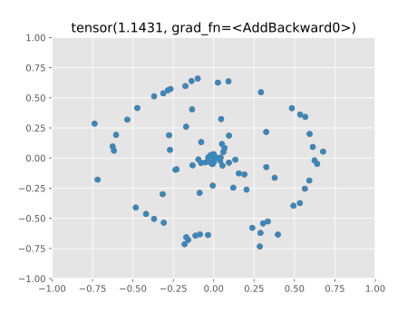

Lorentz Embeddings
==================


A pytorch implementation of [Learning Continuous Hierarchies in the Lorentz Model of Hyperbolic Geometry](https://arxiv.org/pdf/1806.03417.pdf?noredirect=1).

Usage
=====

Binary tree embedding and visualization.

```bash
mkdir images
python bin_tree.py
```

The final embedding for a binary tree in 2 dim. 
